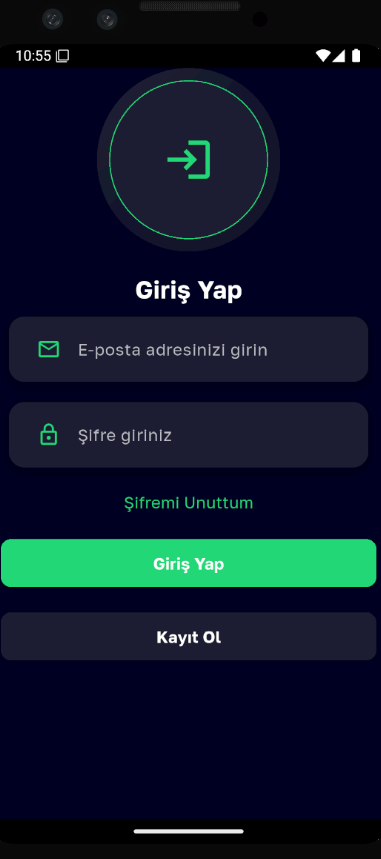
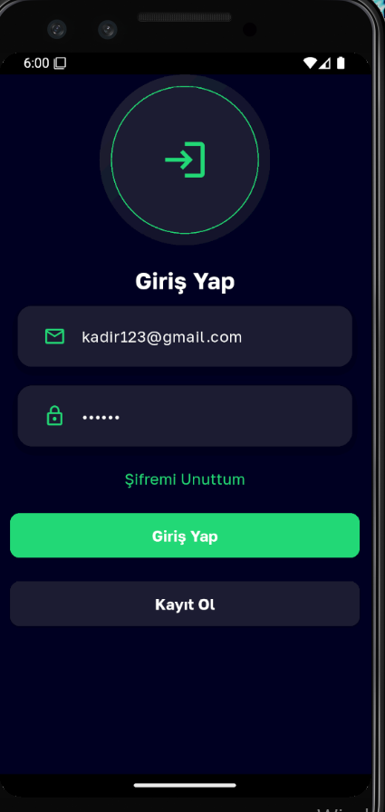
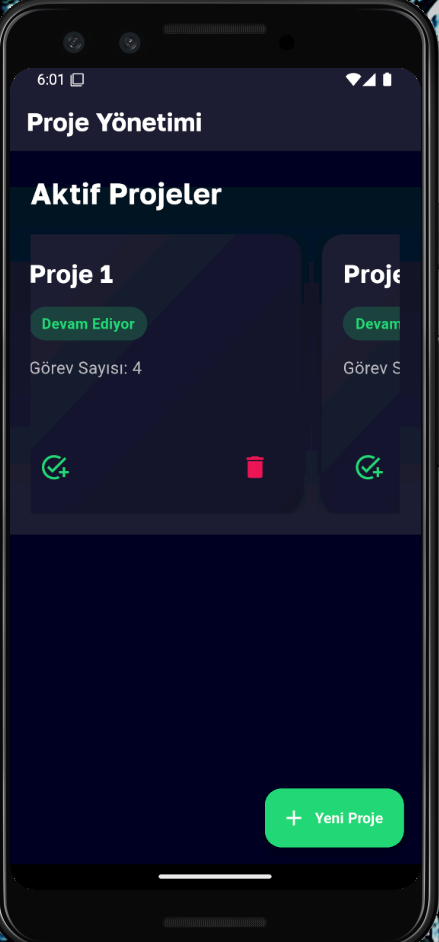
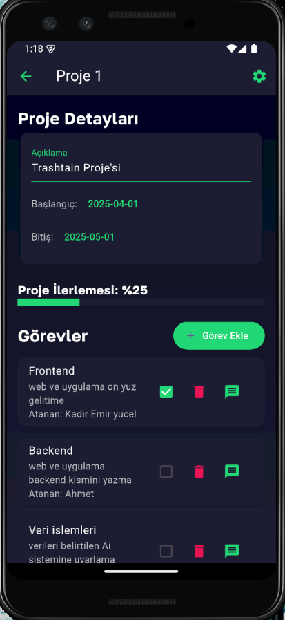

# 🚀 Proje Takip App (Projeis)

Bu uygulama, projeleri ve görevleri (gorev/duty) takip etmek, takım üyeleri arasında asenkron mesajlaşmak ve proje ilerlemesini yönetmek amacıyla geliştirilmiş profesyonel bir **Flutter** uygulamasıdır.

---

## ✨ Özellikler

- 🔑 **Kimlik Doğrulama**: Firebase Auth destekli güvenli giriş ve kayıt sistemi.
- 📊 **Proje Yönetimi**: Yeni projeler oluşturma, silme ve düzenleme.
- ✅ **Görev Takibi (Task Tracking)**: Projelere bağlı görevler ekleme, tamamlanma durumunu işaretleme.
- 💬 **Mesajlaşma (Duty/Chat)**: Görevlere atanan kişilerle gerçek zamanlı Firebase Firestore tabanlı mesajlaşma.
- 🛠️ **Ayarlar**: Profil bilgileri, bildirim ve tema tercihlerini yönetme.
- 📈 **İlerleme Çubuğu**: Proje bazlı görevlerin tamamlanma yüzdesini görsel olarak takip etme.

---

## 📂 Dosya Yapısı (Professional Architecture)

Proje, sürdürülebilir ve ölçeklenebilir bir yapıya (`Clean-like Architecture`) sahiptir:

- **`lib/core/`**: Uygulama genelinde paylaşılan tema, renkler ve sabitler.
- **`lib/data/`**: Veri modelleri, JSON dönüşümleri ve Firebase servisleri.
- **`lib/screens/`**: Özellik bazlı (Auth, Home, Project, Task) ekranlar.
- **`lib/widgets/`**: Uygulama genelinde kullanılan atomik UI bileşenleri.
- **`screenshots/`**: Uygulamanın görsel tanıtımları.

---

## 📸 Ekran Görüntüleri

| Giriş Ekranı | Ana Ekran | Proje Detayı | Mesajlaşma |
| :---: | :---: | :---: | :---: |
|  |  |  |  |

---

## 🚀 Kurulum ve Çalıştırma

1.  Repository'yi klonlayın:
    ```bash
    git clone https://github.com/kullanici/proje_takip_App.git
    ```
2.  Bağımlılıkları yükleyin:
    ```bash
    flutter pub get
    ```
3.  Uygulamayı çalıştırın:
    ```bash
    flutter run
    ```

---

## 🛠️ Teknolojiler

- **Flutter & Dart**
- **Firebase Authentication** (Kimlik Doğrulama)
- **Firebase Cloud Firestore** (Mesajlaşma Sistemi)
- **Firebase Realtime Database** (Görev Verileri)
- **Google Fonts** (Golos Text)
- **Shared Preferences** (Yerel Ayarlar)

---

## 🛡️ Lisans

Bu proje MIT Lisansı altında lisanslanmıştır. Örnek uygulama amaçlıdır.